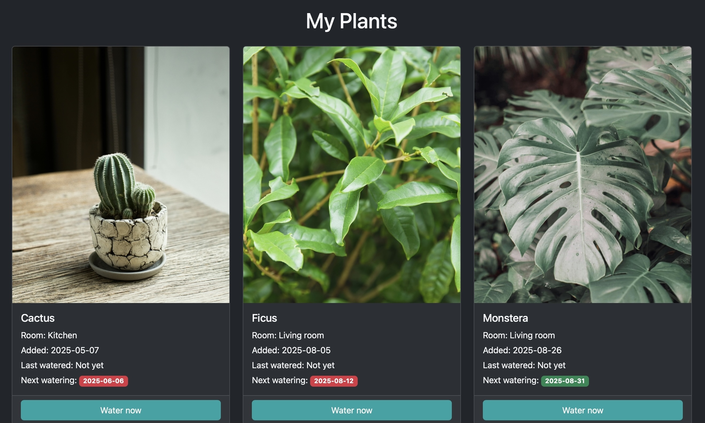
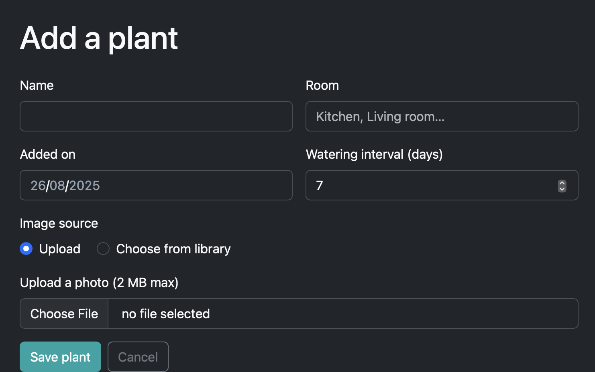

# PlantWeb

Track your houseplants, store photos, and never miss a watering. Built with **Python**, **Flask** and **SQLite** for a CS50 final project.

- Add plants with either an uploaded image or a stock image from `static/stock/`
- Images are resized server-side to fast thumbnails; album images are **lazy-loaded** with fixed dimensions
- Due-date logic: next watering is computed from the last watering or the added date
- Auth (register/login) with hashed passwords and server-side sessions
- **CSRF protection** on all POST forms
- Optional **email** on user accounts (migrated automatically if missing)
- Clean Bootstrap UI with empty state and due-status badges

**Live demo:** https://final-project-cs50.onrender.com/
**Repo:** https://github.com/YofiClemy/Final-Project-CS50

---
## Video demo

<p align="center">
  <a href="https://youtu.be/434FBv_-nKc" target="_blank" rel="noopener noreferrer">
    
  </a>
</p>
---

## Screenshots

- Login  
  
- Album  
  
- Add Plant  
  

## Features

- **User accounts:** username + password (hashed with Werkzeug). Optional email field. “Remember me” support (7-day session) if enabled.
- **Plant album:** name, room, added date, last watered, watering interval (clamped 1–365 days).
- **Scheduling badges:** next watering date computed from last watered or added.
  - Red = overdue (`days_left < 0`)
  - Yellow = due soon (`days_left <= 1`)
  - Green = on track (otherwise)
- **One-click “Water now”:** POST action updates the last-watered date to today (protected with CSRF).
- **Images:** choose from a stock library in `static/stock/` or upload an image (2 MB cap).
  - Uploads are normalized to JPEG thumbnails server-side with Pillow.
  - Album images are lazy-loaded and rendered with fixed width/height to avoid layout shift.
- **Empty state:** friendly SVG and CTA when you have no plants.
- **Security:** CSRF tokens on every POST form; HTTPOnly, SameSite=Lax cookies; Secure cookies in production.
- **Schema bootstrap:** SQLite schema is created and lightly migrated at startup (adds missing columns like `email`, `photo_*`).
- **Health check:** `/healthz` endpoint for deployments.

---

## Tech Stack

- **Backend:** Python 3.11+, Flask 3
- **Templates/UI:** Jinja2, Bootstrap 5 (+ Bootstrap Icons), light/dark theme toggle
- **Images:** Pillow for server-side resizing/normalization
- **Auth & Sessions:** Werkzeug password hashing, Flask-Session (filesystem)
- **Database:** SQLite (default `instance/database.db`) with tiny auto-migrations
- **Security:** minimal custom CSRF guard; secure cookie settings
- **WSGI/Deploy:** gunicorn; Render Web Service (env: `SECRET_KEY`, optional `DATABASE_FILE`)

## Project Structure

```
.
├── app.py
├── schema.sql
├── requirements.txt
├── gunicorn_config.py
├── templates/
│   ├── layout.html
│   ├── login.html
│   ├── main.html
│   ├── add_plant.html
│   ├── edit_plant.html
│   └── album.html
├── static/
│   ├── logo.png
│   ├── default_plant.jpg
│   ├── empty-plants.svg
│   └── stock/            # stock images live here (e.g., cactus.jpg)
└── instance/             # created at runtime (ignored by git)
    └── database.db       # SQLite DB (auto-created)
```

`instance/` is created automatically and should be **gitignored**.

---

## Quickstart (Local)

Requirements: Python 3.11+

```bash
python -m venv .venv
source .venv/bin/activate          # Windows: .venv\Scripts\activate
pip install -r requirements.txt
export SECRET_KEY="change-me"      # or set in your shell/profile
flask --app app run                
```

The database is stored at `instance/database.db`. The schema is **auto-applied** at startup.  
Prefer manual init?

```bash
sqlite3 instance/database.db < schema.sql
```

---

## Configuration

Environment variables:

- `SECRET_KEY` (required) session signing secret
- `DATABASE_FILE` (optional) absolute path to a custom SQLite file

App config (see `app.py`):

- `MAX_CONTENT_LENGTH = 2 * 1024 * 1024` (2 MB upload cap)
- `SESSION_COOKIE_HTTPONLY = True`
- `SESSION_COOKIE_SAMESITE = "Lax"`
- `SESSION_COOKIE_SECURE = True` in production (Render is HTTPS)

### Optional: “Remember me”
```python
from datetime import timedelta
app.config["PERMANENT_SESSION_LIFETIME"] = timedelta(days=7)
# in login POST:
session.permanent = request.form.get("remember") == "on"
```

---

## Stock Image Library

1. Put JPG/PNG files into `static/stock/` (keep them small, e.g., ≤ 200 KB).
2. Map keys to filenames in `app.py`:

```python
STOCK_IMAGES = {
    "cactus": "stock/cactus.jpg",
    "ficus": "stock/ficus.jpg",
    "monstera": "stock/monstera.jpg",
    "succulent": "stock/succulent.jpg",
    "snake_plant": "stock/snake_plant.jpg",
    "pothos": "stock/pothos.jpg",
}
```

3. On the “Add Plant” page, choose **Upload** or **Choose from library**.

Album display prefers: Uploaded photo → Stock image → Default placeholder.

---

## CSRF Protection

A minimal CSRF guard is active for all non-GET requests. Include the token in every POST form:

```html
<input type="hidden" name="csrf_token" value="{{ session.csrf_token }}">
```

For `fetch()` calls, send it as a header:
```js
fetch("/water/123", { method:"POST", headers:{"X-CSRF-Token":"{{ session.csrf_token }}"} });
```

---

## Database & Migrations

The app bootstraps the schema at startup and applies tiny migrations if needed.

**Users** table now supports an optional `email` column.  
If your existing DB lacks it, the app will run:

```sql
ALTER TABLE Users ADD COLUMN email TEXT;
CREATE UNIQUE INDEX IF NOT EXISTS idx_users_email ON Users(email);
```

`schema.sql` reflects the same structure.

---

## Security Notes

- **Password hashing:** Credentials are hashed with Werkzeug’s PBKDF2; plaintext is never stored.
- **CSRF protection:** All non-GET requests require a CSRF token (hidden form field or `X-CSRF-Token` header). Forms include the token; the server verifies it before processing.
- **Sessions:** Server-side sessions via Flask-Session (filesystem). Cookies are `HttpOnly` and `SameSite=Lax`; set `SESSION_COOKIE_SECURE=True` in production (HTTPS). Optional “Remember me” uses a bounded `PERMANENT_SESSION_LIFETIME`.
- **Upload handling:** Images are size-capped (2 MB), decoded and normalized with Pillow to JPEG thumbnails, and MIME is constrained. Upload routes are CSRF-protected.
- **DB safety:** All SQL uses parameterized queries; `PRAGMA foreign_keys=ON` is enabled; index on `Plants(user_id)` for isolation and performance.
- **Secrets & data at rest:** `SECRET_KEY` must be provided via environment. The `instance/` directory (sessions, SQLite file) is not committed to git.
- **Known limitations (future hardening):** no email verification or password reset flow; no rate-limiting or lockout; no 2FA; no content security policy tuning. Add these if you keep it public beyond a class demo.

---

## CS50 “Distinctiveness and Complexity”

- **Auth + sessions:** Hashed passwords with Werkzeug; server-side session storage; optional “Remember me” with controlled lifetime.
- **CSRF guard:** Minimal global CSRF middleware with per-form tokens across all POST actions.
- **Images pipeline:** Dual image sources (upload or stock whitelist), server-side normalization to thumbnails with Pillow, lazy-loaded album images with fixed dimensions to prevent layout shift.
- **Data model & migrations:** SQLite schema bootstrap at startup plus lightweight column/index migrations (`photo_*`, `email`) to keep existing DBs compatible.
- **Scheduling logic:** Next-watering computation derived from last watered or added date; status badges (overdue / due soon / OK) driven by `days_left`.
- **UI/UX polish:** Clean Bootstrap 5 templates, empty-state screen, dark/light theme toggle, accessible forms.
- **Deployment realism:** gunicorn config, health check endpoint, secure cookie settings, and environment-based config; guidance for durable storage on a hosted platform.

---

## Requirements

```
Flask==3.0.*
Flask-Session==0.8.0
Werkzeug==3.0.*
gunicorn==22.0.0
Pillow==10.4.0
python-dotenv==1.0.1   # optional for local .env
```

---

## License

MIT — see `LICENSE`